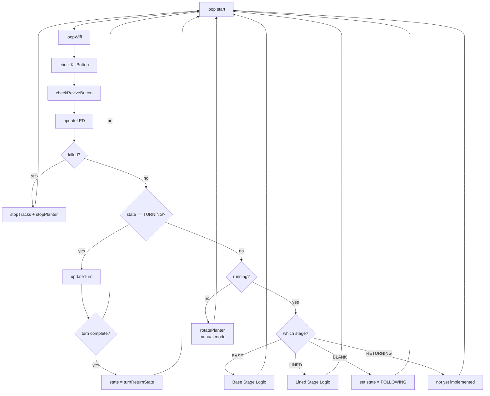
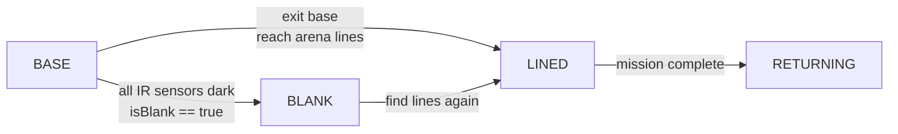

# Flowchart 1: Main Loop & Stage Overview

## Main Loop

```mermaid
flowchart TD
    A[loop start] --> B[loopWifi]
    B --> C[checkKillButton]
    C --> D[checkReviveButton]
    D --> E[updateLED]
    E --> F{killed?}

    F -- yes --> G[stopTracks + stopPlanter]
    G --> A

    F -- no --> H{state == TURNING?}
    H -- yes --> I[updateTurn]
    I --> J{turn complete?}
    J -- yes --> K[state = turnReturnState]
    J -- no --> A

    H -- no --> L{running?}
    L -- yes --> M{which stage?}
    L -- no --> N[rotatePlanter\nmanual mode]
    N --> A
    K --> A

    M -- BASE --> BASE[Base Stage Logic]
    M -- LINED --> LINED[Lined Stage Logic]
    M -- BLANK --> BLANK[set state = FOLLOWING]
    M -- RETURNING --> RET[not yet implemented]

    BASE --> A
    LINED --> A
    BLANK --> A
    RET --> A
```

## Stage Transitions

```mermaid
flowchart LR
    BASE -->|all IR sensors dark\nisBlank == true| BLANK
    BASE -->|exit base\nreach arena lines| LINED
    BLANK -->|find lines again| LINED
    LINED -->|mission complete| RETURNING
```
