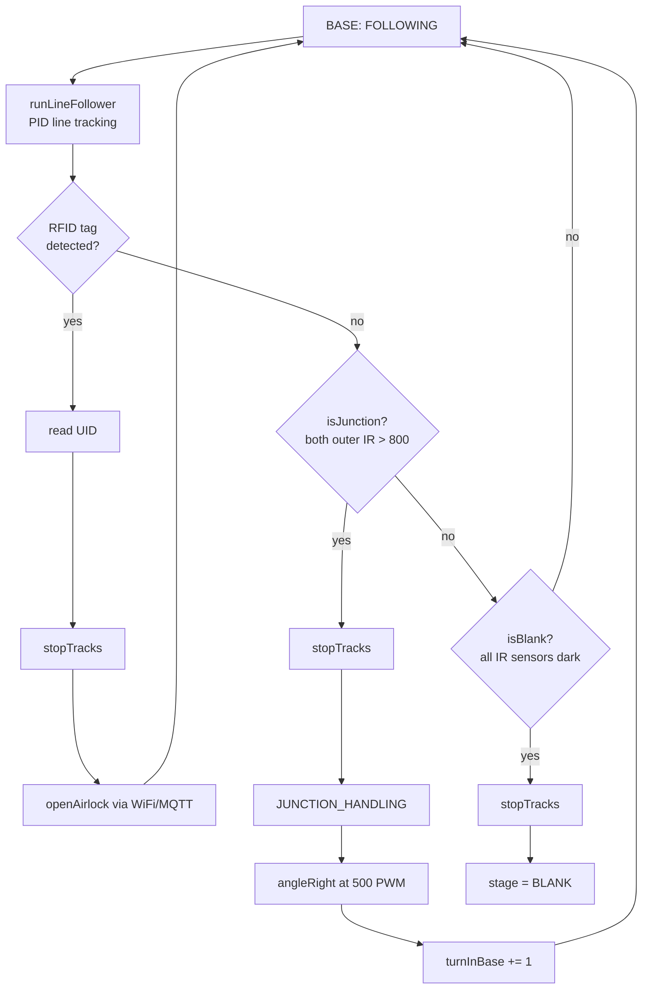
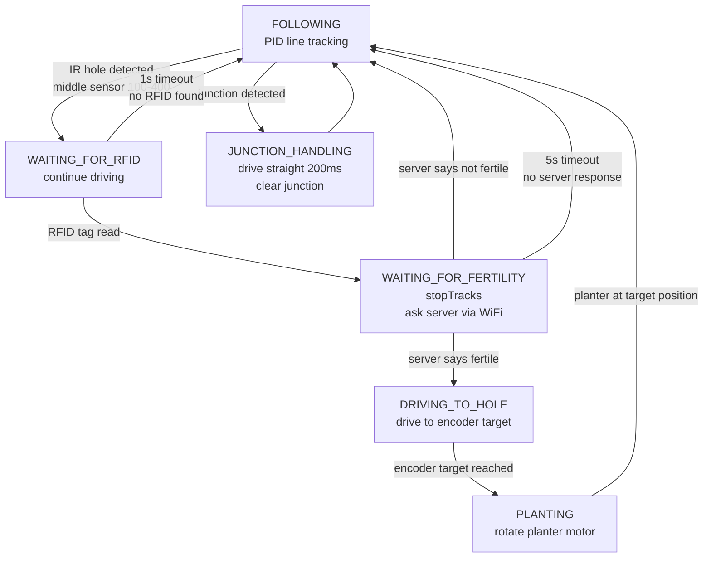
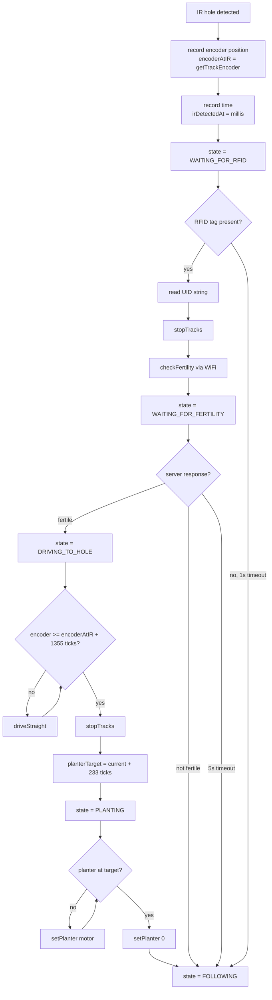

# Flowchart 2: Base Exit (BASE Stage)

```mermaid
flowchart TD
    A[BASE: FOLLOWING] --> B[runLineFollower\nPID line tracking]
    B --> C{RFID tag\ndetected?}
    C -- yes --> D[read UID]
    D --> E[stopTracks]
    E --> F[openAirlock via WiFi/MQTT]
    F --> A

    C -- no --> G{isJunction?\nboth outer IR > 800}
    G -- yes --> H[stopTracks]
    H --> I[JUNCTION_HANDLING]
    I --> J[angleRight at 500 PWM]
    J --> K[turnInBase += 1]
    K --> A

    G -- no --> L{isBlank?\nall IR sensors dark}
    L -- yes --> M[stopTracks]
    M --> N[stage = BLANK]
    L -- no --> A
```

# Flowchart 3: Line Following & Planting Mission (LINED Stage)

## State Machine Overview

```mermaid
flowchart TD
    FOLLOW[FOLLOWING\nPID line tracking] -->|IR hole detected\nmiddle sensor 100-400| WRFID[WAITING_FOR_RFID\ncontinue driving]
    FOLLOW -->|junction detected| JH[JUNCTION_HANDLING\ndrive straight 200ms\nclear junction]

    WRFID -->|RFID tag read| WFERT[WAITING_FOR_FERTILITY\nstopTracks\nask server via WiFi]
    WRFID -->|1s timeout\nno RFID found| FOLLOW

    WFERT -->|server says fertile| DRIVE[DRIVING_TO_HOLE\ndrive to encoder target]
    WFERT -->|server says not fertile| FOLLOW
    WFERT -->|5s timeout\nno server response| FOLLOW

    DRIVE -->|encoder target reached| PLANT[PLANTING\nrotate planter motor]
    PLANT -->|planter at target position| FOLLOW

    JH --> FOLLOW
```

## Planting Sequence Detail

```mermaid
flowchart TD
    A[IR hole detected] --> B[record encoder position\nencoderAtIR = getTrackEncoder]
    B --> C[record time\nirDetectedAt = millis]
    C --> D[state = WAITING_FOR_RFID]
    D --> E{RFID tag present?}
    E -- yes --> F[read UID string]
    F --> G[stopTracks]
    G --> H[checkFertility via WiFi]
    H --> I[state = WAITING_FOR_FERTILITY]
    I --> J{server response?}
    J -- fertile --> K[state = DRIVING_TO_HOLE]
    K --> L{encoder >= encoderAtIR + 1355 ticks?}
    L -- no --> M[driveStraight]
    M --> L
    L -- yes --> N[stopTracks]
    N --> O[planterTarget = current + 233 ticks]
    O --> P[state = PLANTING]
    P --> Q{planter at target?}
    Q -- no --> R[setPlanter motor]
    R --> Q
    Q -- yes --> S[setPlanter 0]
    S --> T[state = FOLLOWING]

    J -- not fertile --> T
    J -- 5s timeout --> T
    E -- no, 1s timeout --> T
```
