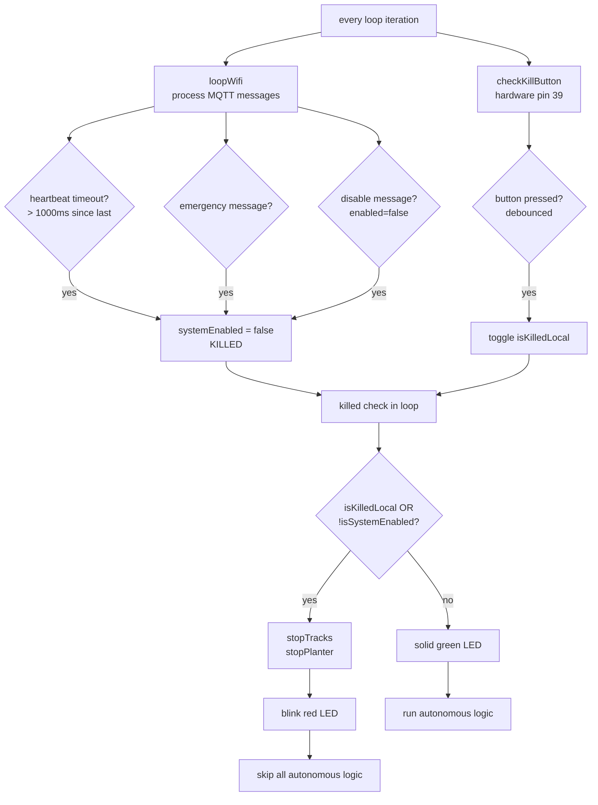
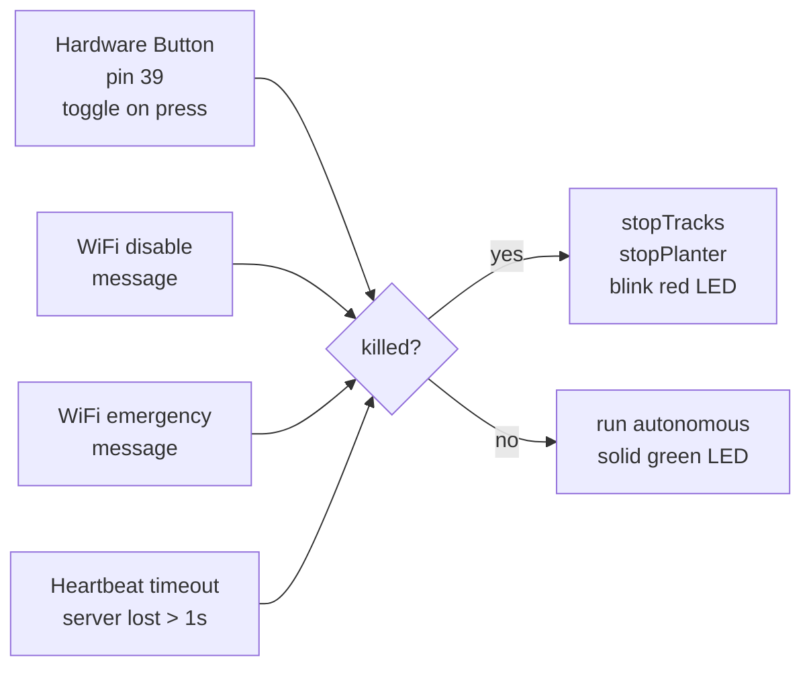
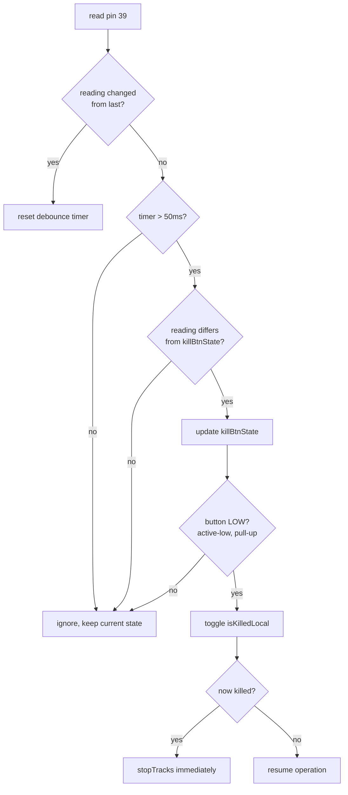
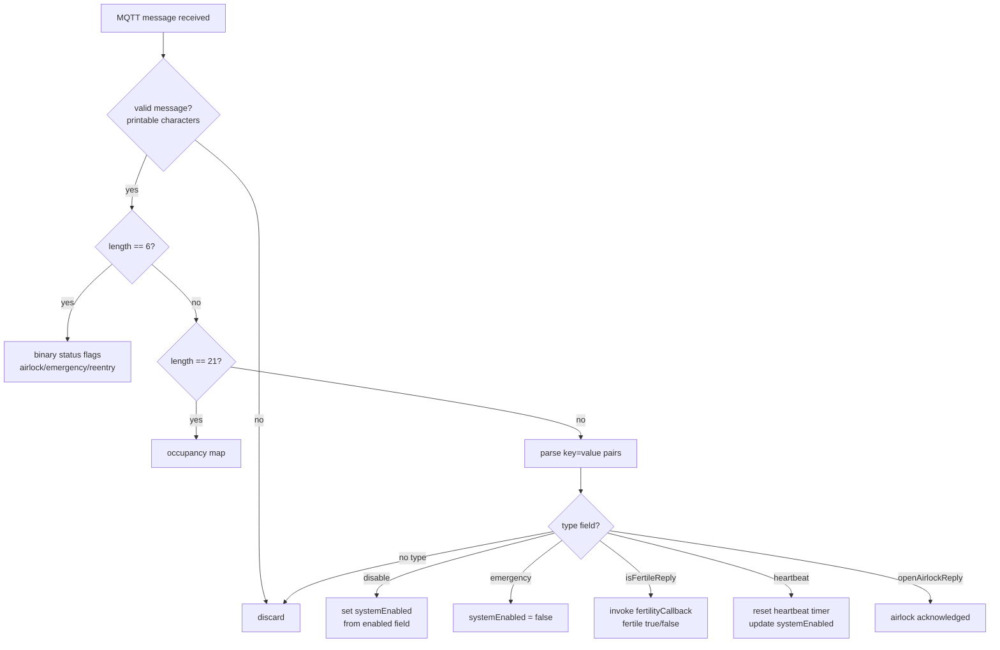
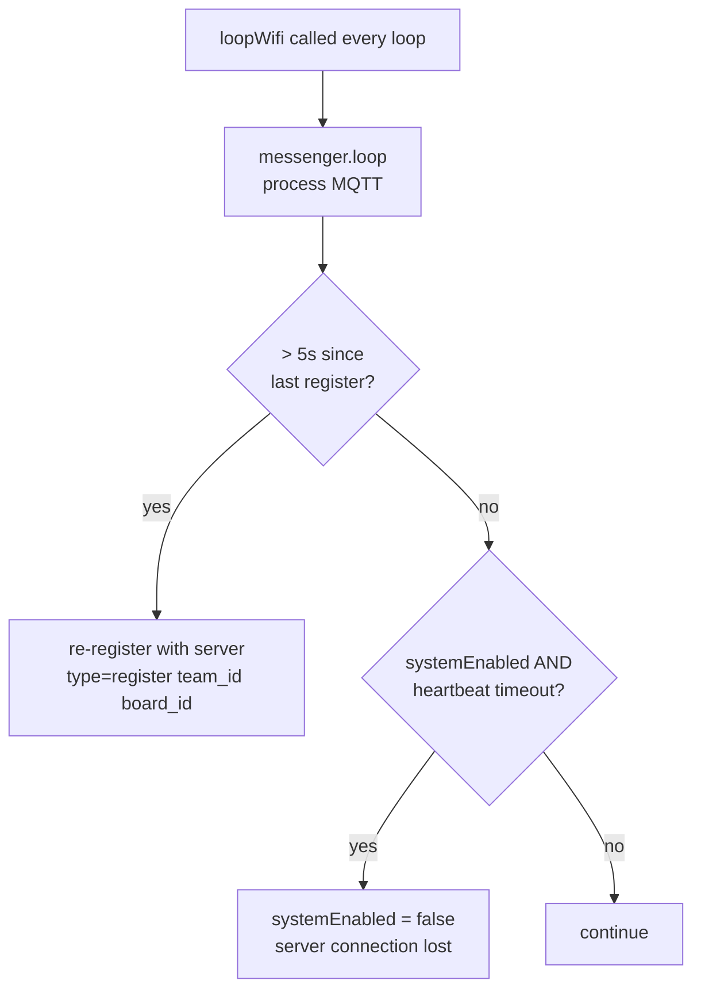

# Flowchart 4: Kill Switch & Safety Handling

## Kill Switch Priority

## Kill Switch Sources

## Button Debounce Logic

# Flowchart 5: WiFi/MQTT Communication

## Message Handling

## Registration & Heartbeat

