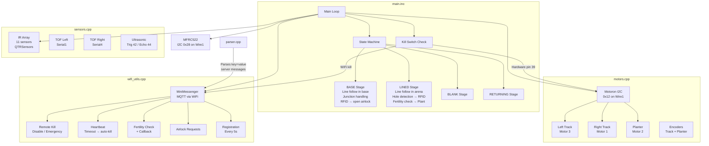

# MEng Robotics and Artificial Intelligence Robotics Challenge 2026, Group 8

## Setup

### Installations

In the Arduino IDE, go to Boards Manager, and install `Arduino Mbed OS Giga Boards` by Arduino. 

Then, go to Library Manager and install the following:
- `MFRC522_I2C` by kkloesener
- `MiniMessenger` by Ziwen Lu, and Alex Charitonidis
- `Motoron` by Pololu
- `QTRSensors` by Pololu

Note that the `QTRSensors` library must be modified before running the code. In `Arduino/libraries/QTRSensors/QTRSensors.cpp`, all the `interrupts()` and `noInterrupts()` function calls must be removed or commented out. This is because these functions cause the Arduino Giga R1 to crash when trying to start up due to its dual core nature.

### Uploading and Running

Plug the Arduino into your computer using a data transmitting USB cable. There are two ways to select the Arduino:
- Click on the dropdown in the top left of the Arduino IDE, to the right of the debugging button, and select the Arduino. It should say something like `Arduino Giga R1` with `COMX` under it, where X is an integer.
- Click on `Tools` in the menubar. Select `Arduino Giga R1` in Board, and `COMX` in Port.

After this, you can click `Verify` to ensure the code compiles correctly. Click `Upload` to begin the uploading process. Once the sketch has been uploaded, you can unplug the Arduino. Then the Arduino begins its calibration process for the IR array.

## Repository Structure

In this repository, there are many folders suffixed with `_test`. These contain sketches that either test individual components, or were set up in advance to a trial run, such as the mechanical design trial.

Additionally, the `checklists/` directory contain the programming and control checklists for easy access.

The `main/` directory is where the code used in the finals will live. In this directory there are many files:
- `main.ino`: the main sketch which runs the robot.
- `secrets.h`: contains sensitive and configuration data such as the WiFi SSID and password, essentially acting as a `.env` file.
- `motors.cpp`: contains functions for motor usage and control.
- `motors.h`: header file for `motors.cpp`.
- `parser.cpp`: file containing a utility function which parses the server response string into a hashmap mapping a string to a string, where "a=1 b=2 c=3" would become `{{"a", "1"}, {"b", "2"}, {"c", "3"}}`.
- `parser.h`: header file for `parser.cpp`.
- `sensors.cpp`: contains functions for obtaining sensor readings.
- `sensors.h`: header file for `sensors.cpp`.
- `wifi_utils.cpp`: handles WiFi communication with the server.
- `wifi_utils.h`: header file for `wifi_utils.cpp`.

## Software Overview

See the flowchart documents for detailed diagrams of each behaviour:

- [FLOWCHARTS1.md](FLOWCHARTS1.md) - Main loop and stage transitions
- [FLOWCHARTS2.md](FLOWCHARTS2.md) - Base exit logic, line following and planting mission
- [FLOWCHARTS3.md](FLOWCHARTS3.md) - Kill switch and safety handling, WiFi/MQTT communication

### Software Overview Diagram

### Algorithm Descriptions

**PID Line Following:** The 11-sensor IR array returns a weighted position value from 0 to 11000, where 5500 is centred on the line. A proportional controller computes the error as `setpoint - position` and applies a correction to the left and right track speeds - if the line drifts left, the right track slows and the left track speeds up, and vice versa. We found that P-only control (Kp=1.0, Ki=0, Kd=0) was sufficient for smooth tracking without oscillation.

**Planting Decision Flow:** While line-following in the arena (LINED stage), the middle IR sensor watches for a hole (reading between 100–400). When detected, the encoder position and timestamp are recorded. The robot continues driving and has a 1-second window to read an RFID tag at that node. If a tag is found, the robot asks the server whether the tile is fertile via WiFi/MQTT. If the server replies fertile within 5 seconds, the robot drives forward a calibrated distance (1355 encoder ticks from the IR detection point) to position the planter over the hole, then rotates the planter motor by 233 ticks (60°) to drop a seed. If the tag isn't found, the tile isn't fertile, or the server times out, the robot skips and resumes line following.

**Base Exit Sequence:** In the BASE stage, the robot follows the line inside the base. At each junction (detected when both the leftmost and rightmost IR sensors read above 800), it turns right. When an RFID tag is detected, it reads the UID and sends an airlock open request to the server via MQTT. If all IR sensors go dark (isBlank), the robot transitions to the BLANK stage to handle the gap between the base and the arena grid lines.

**Kill Switch & Safety:** The system has four independent kill sources, all checked every loop iteration: (1) a hardware button on pin 39 with 50ms debounce that toggles the killed state, (2) a WiFi "disable" message from the server, (3) a WiFi "emergency" message that immediately kills the system, and (4) a heartbeat timeout - if no heartbeat is received from the server within 1 second, the system assumes connection loss and auto-disables. When killed from any source, both track motors and the planter stop immediately, and the LED blinks red. When running, the LED is solid green.

**Encoder-Based Point Turns:** To execute a turn of a given angle, the robot computes the arc length one track must travel: `(trackDistance / 2) * angle * π / 180`, scaled by a calibrated correction factor of 4.75/4. This arc length is converted to encoder ticks using the wheel circumference and counts-per-revolution. The robot then spins the tracks in opposite directions at full speed and monitors the encoder until the target tick count is reached.

### Component Interaction

| Component | Communicates With | Purpose |
|-----------|------------------|---------|
| `main.ino` | All modules | State machine, loop orchestration |
| `motors.cpp` | Motoron (I2C, 0x12) | Track motors, planter motor, encoder reading, point turns |
| `sensors.cpp` | IR array (GPIO), TOF (Serial1/4), Ultrasonic (GPIO) | Line position, distance sensing |
| `wifi_utils.cpp` | MQTT server via MiniMessenger | Kill switch, fertility checks, airlock requests, heartbeat |
| `parser.cpp` | `wifi_utils.cpp` | Parses `key=value` server messages into a map |
| RFID (MFRC522) | I2C (Wire1, 0x28) | Tag identification at grid nodes and base exit |

### Key Constants

| Constant | Value | Meaning |
|----------|-------|---------|
| `baseSpeed` | `500 * 6/7.2` | Nominal PWM scaled for 7.2V battery (6V motor rating) |
| `maxSpeed` | `800 * 6/7.2` | Maximum PWM, voltage-compensated |
| `setpoint` | 5500 | PID target (centre of 11-sensor IR array, range 0–11000) |
| `ticksToHole` | 1355 | Encoder ticks from IR detection to planting hole |
| `ticksToPlant` | 233 | Encoder ticks for one 60° planter rotation |
| `debounceDelay` | 50 ms | Kill switch button debounce threshold |
| `HEARTBEAT_TIMEOUT_MS` | 1000 ms | Server heartbeat timeout before auto-kill |
| `IR_WINDOW_MS` | 1000 ms | Time window to find RFID after IR hole detection |
| `FERTILITY_TIMEOUT_MS` | 5000 ms | Timeout waiting for server fertility response |

## Calibration

### IR Array Calibration

| Parameter | Value | Notes |
|-----------|-------|-------|
| Number of sensors | 11 | We originally wanted to use the given 9 channel IR array with two additional 2 channel IR array at a wider distance to better handle PID control, since this would mean the robot would oscillate less to try find the line. However, one of the edge sensors on the 9 channel IR array wasn't working, so we removed it from the code. We also decided to remove the sensor from the opposite side to balance the IR sensors on each side. |
| Calibration sweeps | 400 | This was the value used in the example in the official `QTRSensors` repository. The file can be found [here](https://github.com/pololu/qtr-sensors-arduino/blob/master/examples/QTRRCExample/QTRRCExample.ino) |
| Calibration method | | Manual sweep across black line on the arena surface. |
| Min/max values observed | | _e.g. min ~50, max ~2500_ |

### Encoder / Distance Calibration

| Parameter | Value | How it was measured |
|-----------|-------|---------------------|
| Counts per revolution | 1400 | When we were testing the planter mechanism, we had try many values for the encoder ticks for 360°. 1200 was too little, but 1600 was too much. Eventually, we narrowed it down to 1400, which worked very well. A week or two later, we learnt that the motor was made by DFRobot, and when we checked their website it said "average output number of pulses can reach up to 7*2*100 pulses per revolution". |
| Wheel diameter | 38.5 mm | Vernier caliper |
| Track distance (between tracks) | 170 mm | Vernier caliper |
| IR-to-hole distance | 116.5 mm / 1355 ticks | Vernier caliper |
| Turn correction factor | 4.75/4 | When testing discrete 90° turning for the robot, we found that running it 5 times led to an approximate 360° turn. Hence, we added the scale factor. 5/4 was too high, 4.8/4 was still slightly too high, and 4.75/4 landed very close to 90°. |
| Ticks for 60° planter rotation | 233 | 1400 / 6 = 233.3333... ≈ 233 |

### PID Tuning

| Controller | Kp | Ki | Kd | Notes |
|------------|----|----|-----|-------|
| Line following | 1.0 | 0.0 | 0.0 | We first used a very small value of Kp, 0.1, and found that it took far to long to centre itself on the line, which resulted in losing the line on corners. We then increased the value to 100, which caused the oscillations to explode, becoming very unstable. Therefore, we began to reduce the Kp, hoping to use the Ziegler-Nichols method for tuning PID, however we found that at Kp = 1, the line following was fast, stable and accurate. While we initially wanted to implement a PID controller, we changed our approach to a P controller as this removed unnecessary complexity and was more time effective.|
| Wall following (control_test) | 4.0 | 0.0 | 7.0 |Small PID parameters could't make the robot turn due to high friction between the rubber tracks and the ground. High $K_d$ is applied to reduce oscillations near the wall during the control test.|

## Testing Evidence

| Date | Test | Result | Notes |
|------|------|--------|-------|
| N/A | IR calibration | N/A | Calibrated immediately before usage of the robot as this achieves the most accurate results. This has the downsides of taking longer to test each iteration of the code|
| 21/05/2026 | Line following (straight) | Successful | Kp = 1. Follows the line successfully, however junctions need to be hardcoded to have a more accurate approach |
| 21/05/2026 | Line following (curves) | Successful | Kp = 1. Follows the curve successfully, including both gentle curves and harsh corners.|
| 26/05/2026 | Junction detection | Successful | The isJunction() function which checks if the 2 end IR sensors are activated returned true consistently at junctions. The temporary driveStraight(int speed) function is used to go through the junction instead of line following in order to be consistent and accurate. |
| 28/04/2026 | RFID reading | Successful | The RFID Scanner was able to both detect and read RFID codes. The range of detection was consistently reading at approximately 0 cm to 2 cm |
| 26/05/2026 | Airlock open request | Successful | The MiniMessenger library was implemented succesfully, and the airlock was opened. Some minor changes were made to the library on 28/05/2026, so the code was altered, and then tested successfully again |
| 07/05/2026 | Planter rotation | Partially Successful | The planter spun successfully, and remained aligned after all 5 seeds were released. However, after further testing, we noticed minor allignement issues due to loose screws, and some wear on the wood. In order to fix this, we replaced the wooden planter with acryllic and tightened the screws so the motor remained perpendicular. After the fixes were made, the planter was fully functional.| 
| 19/05/2026 | Kill switch (hardware) | Successful | The Kill switch was very responsive, and disabled all 3 motors from running until it was pressed again |
| 20/05/2026 | Kill switch (WiFi) | Successful | Disabled and enabling via the website worked well, all motors stopped, and the light on top turned red. |
| 28/05/2026 | Heartbeat timeout | Successful | When no heartbeat was detected within 1 second, the robot deactivates. Otherwise, it succesfully ran. If it recieves a heartbeat and enabled = 0, it stopped.|
| 07/05/2026 | Encoder-based driving | Successful | The robot was able to drive a predetermined distance using the encoders when a command was sent using the Serial.|
| 01/06/2026 | Point turn accuracy | Successful | 90 Degree turns were performed on the arena successfully, with very small error. |
| 02/06/2026 | Revive Mechanism | Successful | The full revival mechanism was functional, including detection and speed reduction. |

